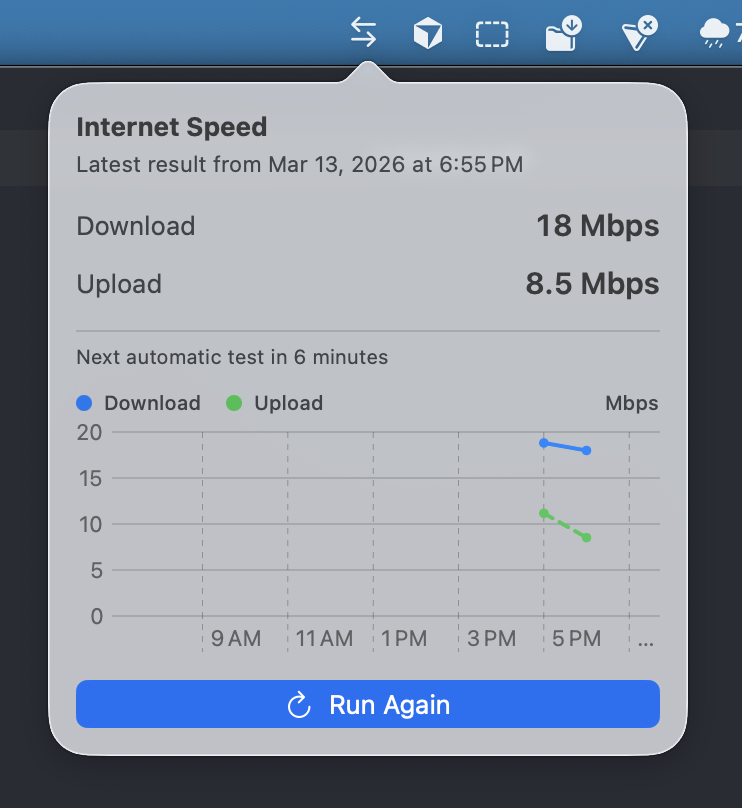

# Internet Speed

`Internet Speed` is a native macOS menu bar app that runs Apple's built-in `networkQuality` test and shows your latest download and upload speeds in a compact popover.

It supports manual tests, automatic background tests on a configurable interval, launch at login, diagnostics export, and a small 12-hour history chart.



## Features

- Menu bar only app with left-click popover and right-click menu
- Manual speed tests using `/usr/bin/networkQuality`
- Automatic background tests on a saved interval from the right-click menu
- Launch at login support from the right-click menu
- Wake and clock-change handling so automatic scheduling recovers after sleep or time changes
- Latest download and upload speeds at a glance
- 12-hour history chart for recent results
- Persistence of the latest result, selected interval, launch-at-login preference, and chart history
- Diagnostics export for support and troubleshooting
- Lightweight menu bar workflow without a Dock icon or main window

## Why this app exists

macOS does not expose a live internet speed value in System Settings. This app fills that gap by letting you run a speed test on demand and by keeping a lightweight history over time.

## Install

For local development:

```bash
open InternetSpeed.xcodeproj
```

For release builds, this project is set up for direct-download distribution from GitHub Releases. The recommended artifact is a zipped `.app` bundle.

## Requirements

- macOS 13 or newer
- Xcode 26 or newer

## Build and run

Open the project in Xcode:

```bash
open InternetSpeed.xcodeproj
```

Or build from Terminal:

```bash
xcodebuild -project InternetSpeed.xcodeproj -target InternetSpeed -configuration Debug CODE_SIGNING_ALLOWED=NO build
open build/Debug/InternetSpeed.app
```

## Run tests

```bash
swift test
```

## How it works

- The app uses Apple's `/usr/bin/networkQuality` command instead of a third-party speed test provider.
- Successful results and settings are stored locally in `UserDefaults`.
- The popover chart shows the last 12 hours of successful test history.
- Automatic tests continue while the app is running in the menu bar at the saved interval.
- The app can register itself to open automatically when you log in.
- Recent structured log entries can be copied to the clipboard from the right-click menu for support.

## Usage

- Left-click the menu bar icon to view the latest speeds, recent history, and run a test manually.
- Right-click the menu bar icon to change the automatic test interval, copy diagnostics, toggle `Open on Login`, or quit the app.
- Automatic tests and the chart both use successful `networkQuality` results, so the graph builds up over time while the app is running.

## Privacy

- The app does not use a third-party analytics or tracking SDK.
- Speed test data and settings stay local on your Mac.
- The diagnostics export copies local metadata and recent app log lines to the clipboard; it does not upload anything automatically.

## Notes

- Results may differ from sites like Fast.com or Speedtest.net because different services use different servers, routes, protocols, and test strategies.
- If you are on a VPN, the measured speeds can differ even more depending on the active tunnel path.
- Right-click the menu bar icon to change the automatic test interval, enable or disable launch at login, or quit the app.

## Troubleshooting

- If launch at login requires approval, open `System Settings > General > Login Items`.
- If the app says Apple's `networkQuality` tool is unavailable, verify you are on a supported macOS version.
- If automatic tests look stale after sleep, wake the Mac and reopen the popover; the app now recalculates the next run after wake and clock changes.
- If you need to report a problem, use `Copy Diagnostics` from the right-click menu and include the pasted report in your issue.

## Project structure

```text
InternetSpeed/
  AppKit + SwiftUI app target
InternetSpeedCore/
  Speed test runner, persistence, scheduler, logging, and view model logic
InternetSpeed.xcodeproj/
  Xcode project
Package.swift
  SwiftPM manifest for tests
```

## Release Notes

- CI runs `swift test` and an Xcode build on GitHub Actions.
- Tagged releases can build zipped app artifacts.
- A notarized release path is included for environments where the required Apple signing secrets are configured.
